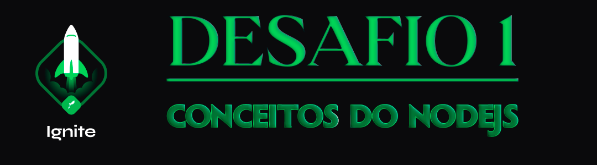

  

<h1 align="center"> RocketSeat 🚀 Ignite NodeJS 🌠</h1>

  
  
  
  

## 🧠 Detalhes do desafio

Nesse desafio, você deverá criar uma aplicação para treinar o que aprendeu até agora no Node.js!

Essa será uma aplicação para gerenciar tarefas (em inglês *todos*). 

Será permitida a criação de um usuário com `name` e `username`, bem como fazer o CRUD de *todos*:

- [x] Criar um novo *todo*;
- [x] Listar todos os *todos*;
- [x] Alterar o `title` e `deadline` de um *todo* existente;
- [x] Marcar um *todo* como feito;
- [x] Excluir um *todo*;

📌 Tudo isso para cada usuário em específico (o `username` será passado pelo header).

  

Feito com ❤️ por [Augusto Hermes](https://github.com/augustohermes) 👋.
